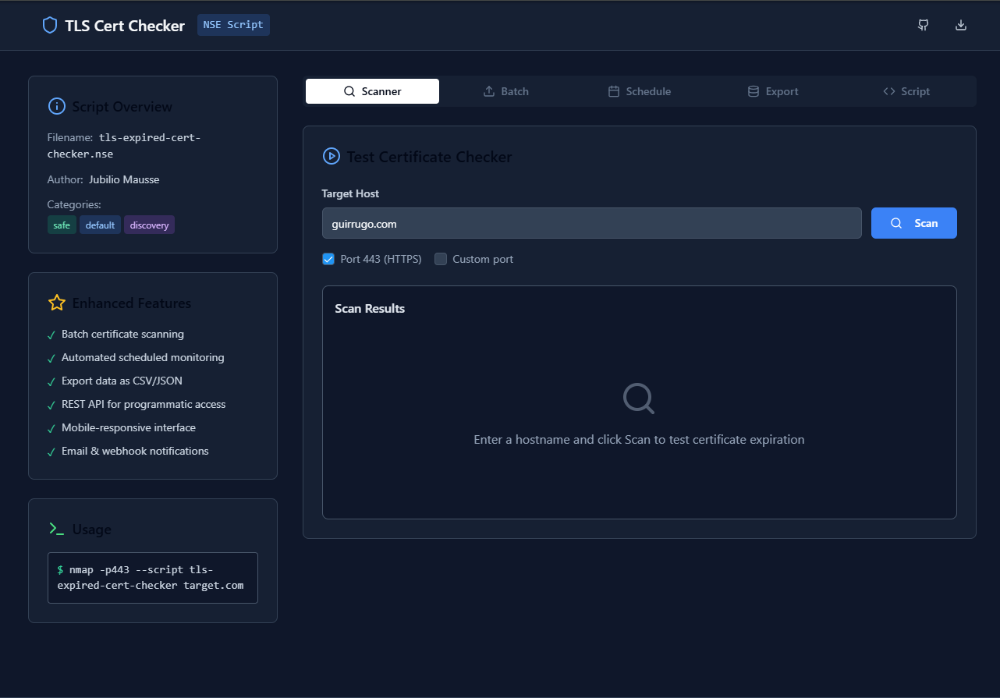

[](https://github.com/Jubilio)

# TLS Cert Watcher 🛡️

**Verificador interativo de certificados TLS/SSL via Nmap NSE + interface web moderna**

---

## ⚡ Visão geral

O **TLS Cert Watcher** é uma aplicação full‑stack projetada para detectar, monitorar e alertar sobre a validade de certificados TLS/SSL em qualquer domínio ou IP. Combina a robustez do Nmap NSE com uma interface web responsiva, oferecendo:

* Script NSE personalizado para extrair e validar datas de vencimento.
* Interface web em tempo real com tema escuro e indicadores visuais (válido, aviso, expirado, erro).
* Scanner interativo (hostname/porta) e varredura em lote.
* Agendamento de scans e histórico de resultados.
* Exportação de relatórios em CSV/JSON, integração via API REST e notificações por e‑mail/webhook.
* Design responsivo, compatível com dispositivos móveis.

---

## 🧩 Recursos principais

* 🔍 **Scanner interativo**: insira domínio e porta para checagem imediata.
* 📦 **Varredura em lote**: carregue listas de hosts para análise em massa.
* 🗓️ **Monitoramento agendado**: configure scans recorrentes via cron.
* 📂 **Exportação de relatórios**: baixe resultados em CSV ou JSON.
* ⚙️ **API REST**: acesse programaticamente o status dos certificados.
* 📡 **Notificações**: envie alertas por e‑mail ou webhook.
* 📥 **Download do script NSE**: obtenha o script diretamente pela UI.

---

## 📸 Demonstração



---

## 🚀 Instalação e uso local

### Pré-requisitos

* **Node.js** ≥ v16
* **Nmap** instalado (`sudo apt install nmap`)

### Clone, build e execução

```bash
# clone
git clone https://github.com/Jubilio/TLS-Cert-Watcher.git
cd TLS-Cert-Watcher

# dependências
npm install

# build (gera frontend + bundle do servidor)
npm run build

# execute em produção
npm start   # servidor ouvirá em http://localhost:3000

# ambiente de desenvolvimento hot-reload
npm run dev # porta 5000 por padrão
```

### Acessando a aplicação

Abra o navegador em `http://localhost:3000` (ou `http://localhost:5000` no modo dev) e use a aba **Scanner** para checar um host. A UI consome os endpoints acima automaticamente.

### Endpoints principais da API

| Método | Rota | Descrição |
| ------ | ---- | --------- |
| GET | `/check-cert?target=HOST&port=443` | Pré-validação (DNS → Ping → HTTPS) + scan NSE |
| GET | `/api/v1/check/:hostname?port=443&engine=nmap` | JSON resumido (`engine=js` usa TLS nativo Node) |
| GET | `/api/download-script` | Baixa o script `tls-expired-cert-checker.nse` |

### Execução manual do script NSE

Você também pode executar o script NSE manualmente:

```bash
# dentro do repositório
nmap -p 443 --script ./public/tls-expired-cert-checker.nse example.com
```

---

## 📦 Deploy contínuo

Recomendamos hospedar em plataformas como **Render**, **Railway** ou **Vercel + Railway**:

1. Conecte o repositório ao serviço.
2. Defina variáveis de ambiente:

   * `SCHEDULE_CRON` – expressões cron para scans agendados.
   * `WEBHOOK_URL` – endpoint para notificações.
   * `EMAIL_SMTP`, `SMTP_USER`, `SMTP_PASS` – configuração de e‑mail.
3. Configure pipelines de CI/CD (veja `.github/workflows/ci.yml`).

---

## 🤝 Contribuições

Contribuições são bem-vindas! Siga o guia em [CONTRIBUTING.md](./CONTRIBUTING.md):

1. Faça um fork.
2. Crie uma branch: `git checkout -b feature/nova-funcionalidade`.
3. Faça commits claros e atenda aos padrões de lint e estilo.
4. Abra um Pull Request explicando a mudança.

Consulte `ROADMAP.md` para ideias de novas funcionalidades e prioridades.

---

## 📜 Licença

Este projeto está licenciado sob a **MIT License**. Veja [LICENSE](./LICENSE) para detalhes.

---

## 📫 Contato

**Jubilio Mausse** – [GitHub](https://github.com/Jubilio) – [jubiliomausse5@gmail.com](mailto:jubiliomausse5@gmail.com)

Projeto: [TLS-Cert-Watcher](https://github.com/Jubilio/TLS-Cert-Watcher)

---

## 📚 Recursos adicionais

* Boas práticas de README: [Awesome Readme](https://github.com/matiassingers/awesome-readme)
* Guia de Open Source: [Codacy Blog](https://blog.codacy.com/best-practices-to-manage-an-open-source-project)
* Templates de perfil GitHub: [Profile Readme Templates](https://github.com/durgeshsamariya/awesome-github-profile-readme-templates)
