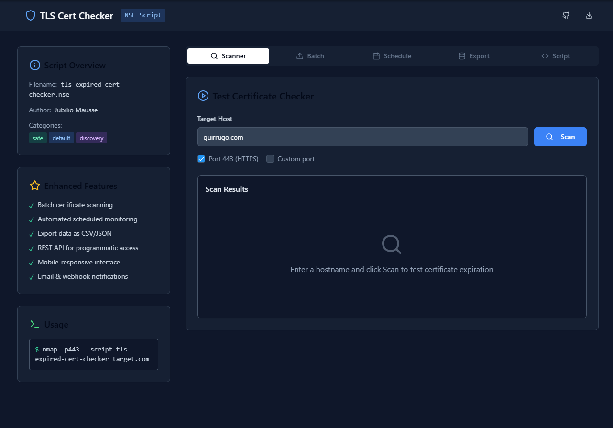

# TLS Cert Watcher

[](https://github.com/Jubilio/TLS-Cert-Watcher/actions/workflows/ci.yml)
[](LICENSE)

Aplicação web para verificar a validade de certificados TLS, individualmente ou em lote. O projeto combina uma interface React, uma API Express, verificações TLS nativas do Node.js e um motor opcional baseado em Nmap NSE.



## Principais recursos

- Verificação direta de certificados em qualquer serviço TLS, sem depender de uma resposta HTTP.
- Estados `valid`, `warning`, `expired` e `error`, com detalhes do emissor, titular e validade.
- Varredura em lote de até 100 alvos e histórico em memória.
- Exportação dos resultados em CSV protegido contra formula injection e em JSON.
- API REST com limitação de pedidos por cliente.
- Script NSE disponível para download e execução manual.
- Imagem Docker executada como utilizador sem privilégios, com Nmap e health check incluídos.

> Os registos de scans agendados já podem ser criados e geridos na interface. A execução automática recorrente, persistência em base de dados e notificações ainda fazem parte do roadmap.

## Requisitos

- Node.js 20 ou posterior.
- Nmap apenas para `engine=nmap`; o motor TLS nativo funciona sem Nmap.
- Docker, opcionalmente, para uma execução isolada e reproduzível.

## Instalação local

```bash
git clone https://github.com/Jubilio/TLS-Cert-Watcher.git
cd TLS-Cert-Watcher
npm ci --legacy-peer-deps
npm run dev
```

A aplicação de desenvolvimento fica disponível em `http://localhost:3000`, salvo se `PORT` tiver outro valor.

Para validar e executar a versão de produção:

```bash
npm run ci
npm start
```

## Docker

```bash
docker build -t tls-cert-watcher:1.1.0 .
docker run --rm -p 3000:3000 tls-cert-watcher:1.1.0
```

O endpoint `GET /api/health` pode ser usado por Docker, Kubernetes ou outro sistema de monitoria.

## API

| Método | Endpoint | Finalidade |
| --- | --- | --- |
| `POST` | `/api/certificate-checks` | Verifica e guarda um alvo `{ hostname, port }` |
| `GET` | `/api/certificate-checks` | Lista o histórico da instância |
| `DELETE` | `/api/certificate-checks` | Limpa o histórico da instância |
| `POST` | `/api/batch-scans` | Inicia uma verificação em lote |
| `GET` | `/api/batch-scans/:id` | Consulta progresso e resultados do lote |
| `GET` | `/api/v1/check/:hostname` | Verificação sem guardar; aceita `port` e `engine=js|nmap` |
| `GET` | `/api/export/csv` | Exporta o histórico em CSV |
| `GET` | `/api/export/json` | Exporta o histórico em JSON |
| `GET` | `/api/download-script` | Baixa o script NSE canónico |
| `GET` | `/api/health` | Verifica a saúde do serviço |

Exemplo:

```bash
curl "http://localhost:3000/api/v1/check/example.com?port=443&engine=js"
```

## Configuração

Copie `.env.example` e defina as variáveis necessárias no ambiente de execução.

| Variável | Padrão | Descrição |
| --- | --- | --- |
| `PORT` | `3000` | Porta HTTP da aplicação |
| `SCAN_RATE_LIMIT` | `30` | Máximo de pedidos de scan por IP e minuto |
| `CORS_ORIGINS` | vazio | Origens web autorizadas, separadas por vírgulas |
| `TRUST_PROXY` | `0` | Use `1` quando existir um proxy reverso confiável |
| `ALLOW_PRIVATE_TARGETS` | `false` | Autoriza IPs privados e internos |

### Modelo de segurança dos alvos

Por padrão, a aplicação bloqueia endereços privados, loopback, link-local, metadata e intervalos reservados, reduzindo riscos de SSRF. Para monitorizar serviços internos, `ALLOW_PRIVATE_TARGETS=true` pode ser ativado apenas numa implantação privada e protegida por controlo de acesso. Nunca exponha publicamente uma instância com essa opção ativada.

O motor Nmap utiliza argumentos separados, sem execução por shell, e tem timeout de 30 segundos.

## Script NSE manual

```bash
nmap -Pn -p 443 --script ./public/tls-expired-cert-checker.nse example.com
```

## Qualidade e contribuição

O CI executa type-checking, testes, build da aplicação e build da imagem Docker. Consulte [CONTRIBUTING.md](CONTRIBUTING.md), [SECURITY.md](SECURITY.md) e [CHANGELOG.md](CHANGELOG.md) antes de contribuir ou publicar uma versão.

## Licença

Distribuído sob a [licença MIT](LICENSE).
